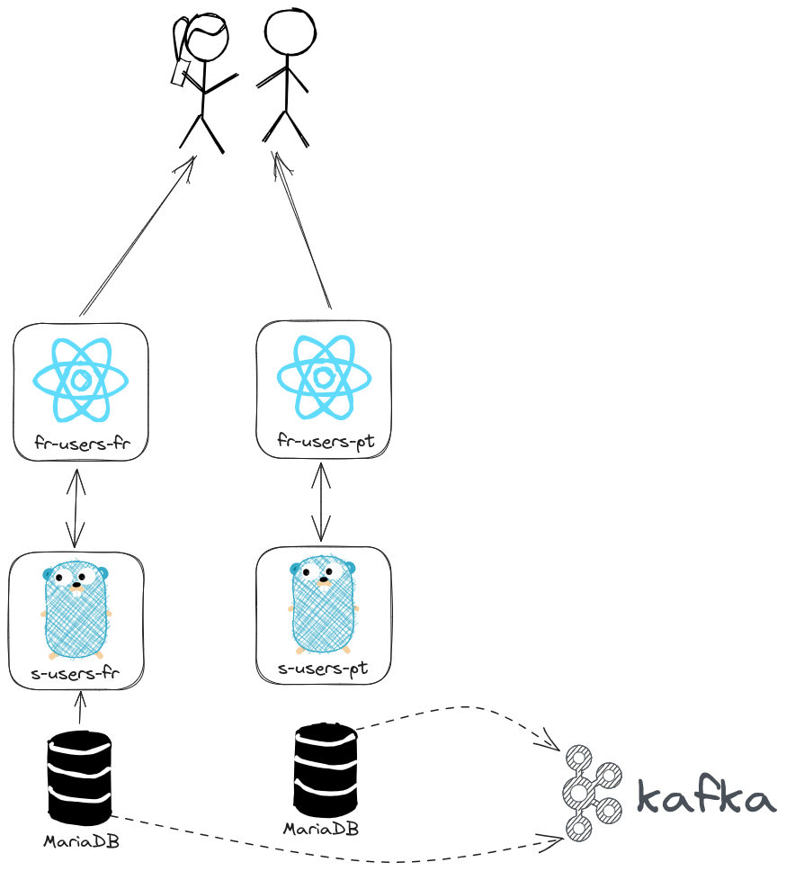

Change Data Capture (CDC) is a design pattern that captures changes made at a source and replicates them to a destination.

In this example, we'll move data from some databases to a Kafka topic, the data will be transformed and saved into another destination database.



# Start up

Operator installation:

```bash
oc apply -f gitops/bootstrap/openshift-gitops.yaml
```

Retrieve ArgoCD route: 

```bash
oc get route -A | grep openshift-gitops-server | awk '{print $3}'
```

Get the ArgoCD admin password: 

```bash
oc -n openshift-gitops get secret openshift-gitops-cluster -o json | jq -r '.data["admin.password"]' | base64 -d
```

ArgoCD needs some privileges to create specific resources. In this demo, we'll apply cluster-role to ArgoCD to avoid the fine-grain RBAC.

```bash
oc apply -f gitops/bootstrap/cluster-role.yaml
```

Now, we apply the bootstrap application:

```bash
oc apply -f gitops/bootstrap/bootstrap.yaml
```