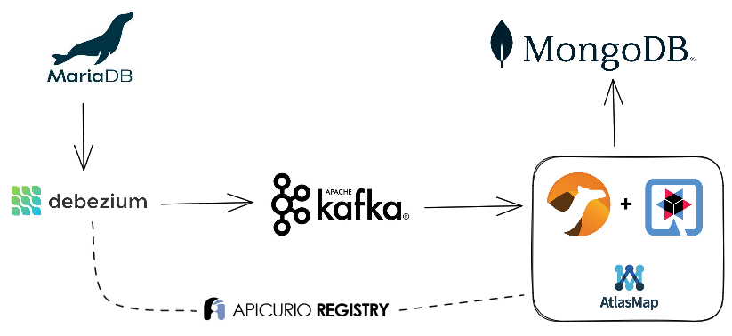

# Camel Quarkus and Debezium

This project uses Quarkus, the Supersonic Subatomic Java Framework. If you want to learn more about Quarkus, please visit its website: https://quarkus.io/ .

The microservice is implemented with Camel extensions for Quarkus.

## Scenario




Process flow:

1. The microservice consumes _Debezium_ events from a Kafka topic
   + Events are extracted from a remote SQL database by a Debezium KafkaConnector already deployed and running. Debezium serializes the events using [AVRO](https://avro.apache.org/) and publishes the schemas into the [Apicurio Registry](https://www.apicur.io/registry/) and the events into a Kafka topic.
   + The **Camel Kafka** component consumes the events from the topic and it is also connected to the Apicurio Registry to deserialize the events from AVRO to JSON.

2. The microservice maps the consumed event into a target POJO/entity by using [AtlasMap](https://www.atlasmap.io/)
   + The microservice configuration defines which mapper is used.
   + There are two mappers included in the project, for two different source JSON schemas (`france` and `portugal`):
     + france-to-central-mapping.adm
     + portugal-to-central-mapping.adm
   
     Both of them map the values to the same target POJO (the `central` JSON schema).
   
   + The mapping also applies some basic transformations (trimming spaces and it changes some text to uppercase).

    Example: mapping records from the SQL _France_ table into the POJO

    

    Example: mapping records from the SQL _Portugal_ table into the POJO

    


3. It enriches the POJO with additional data (just adding the last time the document was updated).

4. Depending on the debezium event:
   
   + It creates/inserts a new document into a MongoDB collection persisting the POJO.
   + It updates the previous existing document in MongoDB
   + It deletes the document in MongoDB


## Running the application in dev mode

You can run your application in dev mode that enables live coding using:
```shell script
mvn compile quarkus:dev
```

> **_NOTE:_**  Quarkus now ships with a Dev UI, which is available in dev mode only at http://localhost:8080/q/dev/.

## Packaging and running the application

The application can be packaged using:
```shell script
mvn package
```
It produces the `quarkus-run.jar` file in the `target/quarkus-app/` directory.
Be aware that it’s not an _über-jar_ as the dependencies are copied into the `target/quarkus-app/lib/` directory.

The application is now runnable using `java -jar target/quarkus-app/quarkus-run.jar`.

If you want to build an _über-jar_, execute the following command:
```shell script
mvn package -Dquarkus.package.type=uber-jar
```

The application, packaged as an _über-jar_, is now runnable using `java -jar target/*-runner.jar`.

## Creating a native executable

You can create a native executable using: 
```shell script
mvn package -Dnative
```

Or, if you don't have GraalVM installed, you can run the native executable build in a container using: 
```shell script
mvn package -Dnative -Dquarkus.native.container-build=true
```

You can then execute your native executable with: `./target/code-with-quarkus-1.0.0-SNAPSHOT-runner`

If you want to learn more about building native executables, please consult https://quarkus.io/guides/maven-tooling.

